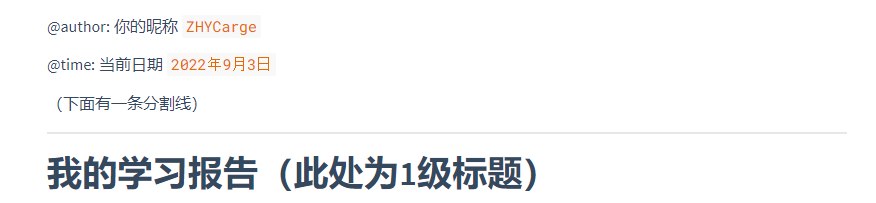
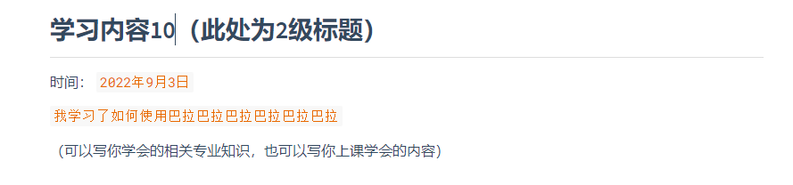
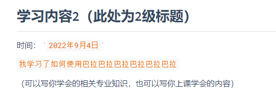
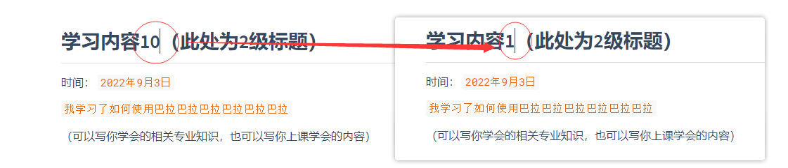
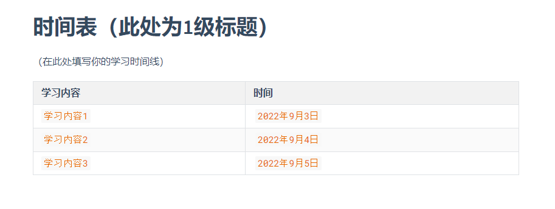
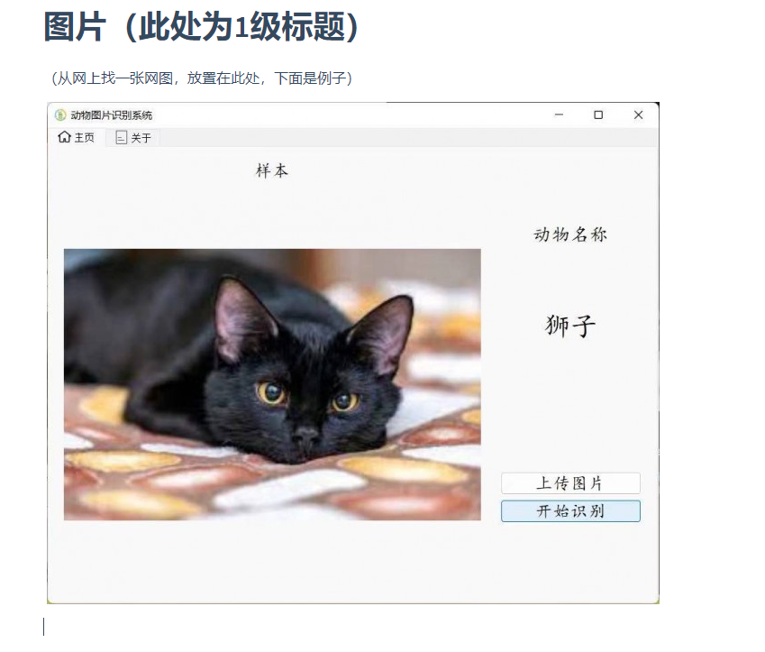
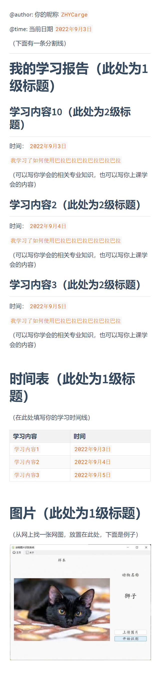

# 前言

好耶，假设你已经看完并且了解了如何去使用`Markdown`、`Git`、`GitHub`，那么便开始如下的小练习叭

什么？你还没有学习怎么使用这三个工具？快去学！（[甩给你的链接](https://github.com/GUET-EETB/GitHub-exercise)

# 任务列表

你需要完成如下任务，其中包含的知识点为你这周学到的知识总和。

请按照步骤逐步进行操作，此项考核会划入基地考核内容中去

1. 使用GitHub Fock这个仓库到个人名下，并且clone到本地

2. 打开文件夹 `exercise`，并创建一个以`学号-个人昵称`命名的个人文件夹。如 `1900300033-法外狂徒张三`

3. 进入文件夹之后，创建一个命名格式为:`学习记录.md`的文件

4. 使用你的Markdown编辑器打开此文件，并将其写入如下内容

   （后面黄色部分为示例，括号内文字不需要填写）：

   

5. 然后使用git命令将此文件添加到仓库中，并且提交信息填写为"`feat: add author and somethings`"

6. 然后继续使用你的Markdown编辑器打开此文件，并写入如下内容：

   （后面黄色部分为示例，括号内文字不需要填写）：

   

7. 然后使用git命令将此文件添加到仓库中，并且提交信息填写为"`docs: new study1`"

8. 然后继续使用你的Markdown编辑器打开此文件，并写入如下内容：

   （后面黄色部分为示例，括号内文字不需要填写）：

   

9. 然后使用git命令将此文件添加到仓库中，并且提交信息填写为"`docs: new study2`"

10. 然后继续使用你的Markdown编辑器打开此文件，并写入如下内容：

    （后面黄色部分为示例，括号内文字不需要填写）：

    

11. 然后使用git命令将此文件添加到仓库中，并且提交信息填写为"`docs: new study3`"

12. 之后使用Git命令，将上面的三次提交，合并成一次提交，并且修改提交信息为"`feat: 我正在编写作业`"

13. 之后使用Git的分支功能，创建一个`dev`分支，之后回到你的主分支上，将 `学习内容10`修改成 `学习内容1`：

    

14. 使用Git命令，提交本次修改，提交信息随意

15. 使用你的Markdown编辑器继续打开这个文件，并写入如下内容：
    （后面黄色部分为示例，括号内文字不需要填写）：

    

16. 然后使用git命令将此文件添加到仓库中，并且提交信息填写为"`docs: new study_time`"

17. 使用Git命令，切换分支到 `dev`分支，并完成如下内容：

18. 使用你的Markdown编辑器继续打开这个文件，并写入如下内容：
    （后面黄色部分为示例，括号内文字不需要填写）：

    

19. 然后使用git命令将此文件添加到仓库中，并且提交信息填写为"`docs: new some_picture`"

20. 使用Git命令，将主分支和 `dev`分支合并成一个分支

    （在此处一定会报冲突错误，需要你同时保留主分支的信息，并保留dev分支的修改）

    合并的时候提交信息为："`merge dev and main`"

21. 将整个仓库push到自己的GitHub账户下，并且向我们提交PR信息

    其中，PR信息命名为："`学号-姓名-exercise`"并且注明你Fock的个人仓库地址，以便我们查看

22. 在我们检查完毕后，会通过你的PR，至此，任务结束

最后，你的学习报告应该是这个样子：

  

# 其他

如有兴趣留下你的名字，可以在fork到本地的`honour.md`下，按照规范格式，将自己的名字添加到下面，留作纪念
