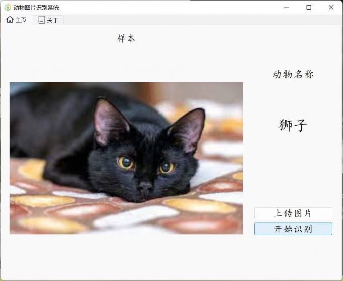

@author:  ZHYCarge

@time:  2022年9月3日

---

# 我的学习报告

## 学习内容1

时间： 2022年9月3日

制作培训教程

## 学习内容2

时间： 2022年9月4日

完善培训教程

## 学习内容3

时间： 2022年9月5日

实践代码逻辑性

# 时间表（此处为1级标题）

| 学习内容  | 时间         |
| --------- | ------------ |
| 学习内容1 | 2022年9月3日 |
| 学习内容2 | 2022年9月4日 |
| 学习内容3 | 2022年9月5日 |
# 图片

